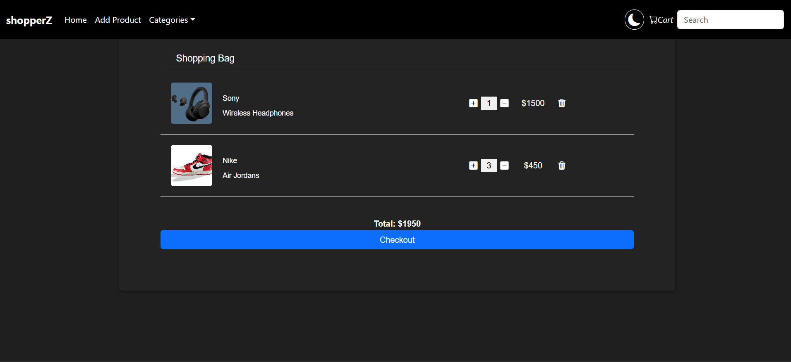

# Basic Ecommerce Application

This is a basic CRUD-based eCommerce web application built using Spring Boot and ReactJS. It allows users to manage products through a simple and responsive user interface.

---

## Features

- Add, update, and delete products
- View detailed product information
- Search products using the search bar
- Add products to cart / checkout
- Filter products by category
- Upload and edit product images
- Frontend and backend connected using APIs

---

## Tech Stack

- Frontend: ReactJS
- Backend: Spring Boot
- API Testing: Postman

---

## How to Run the Project

### Frontend (ReactJS)

1. Open the `frontend` folder in VS Code (or any editor)
2. In the terminal, navigate to the folder:
   ```bash
   cd [path-to-frontend-folder]
   npm install
   npm run dev
3. The frontend will start on: http://localhost:5173

### Backend (SpringBoot)

1. Open the `Ecom-App` folder in any IDE
2. run the springboot application class
Note: Both the frontend and backend must be running at the same time for the application to work correctly.

---
## ScreenShots

### Homepage


### Product Details


### Add a product


### Add to Cart


### Checkout from cart

